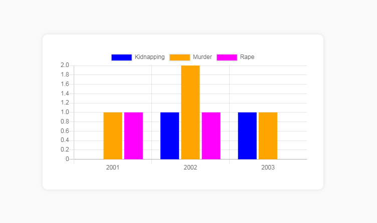

<h1> Example of Chartjs loading data from php rest api </h1>

Chartjs https://www.chartjs.org/

<h2>PHP Rest Api End Points</h2>

API : http://localhost/wop/php/prj0001-UsingChartJs/api/api.php?readLabels

Response:

["2001","2002","2003"]

------------------------------------------------------------

API : http://localhost/wop/php/prj0001-UsingChartJs/api/api.php?readDataSets

Response: 

[{"crime":"Kidnapping","data":[0,1,1]},{"crime":"Murder","data":[1,2,1]},{"crime":"Rape","data":[1,1,0]}]

