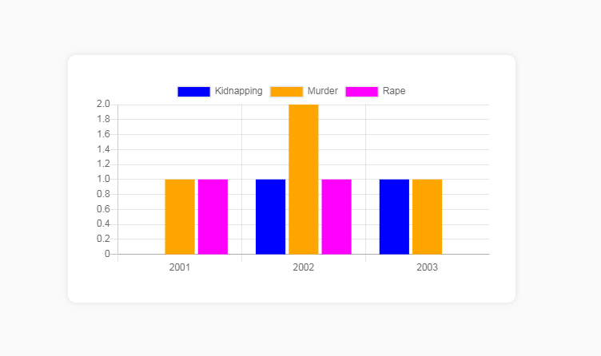
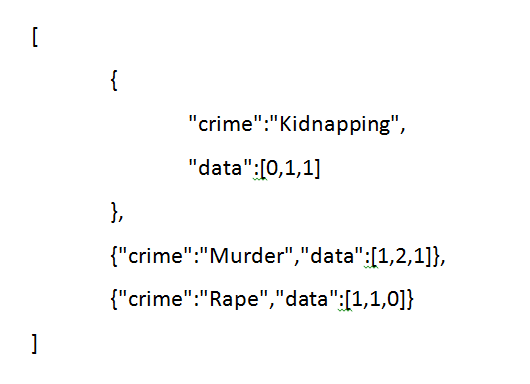

<h1> Example of Chartjs loading data from php rest api </h1>

Chartjs https://www.chartjs.org/

<h2>PHP Rest Api End Points</h2>

<h5>Directory Structure:</h5>
<ul>
    <li>inc - folder</li>
    <li>vendor - folder</li>
    <li>.env - env variable files</li>
    <li>api.php - api end file</li>
    <li>composer.php - composer file</li>
    <li>composer.lock - composer file</li>
</ul>

We have used https://github.com/vlucas/phpdotenv package to load enviroment variables from .env file. If you don't want to use it, you can remove .env , vendor (folder), composer.php and composer.lock and write env variables directly in api.php file

API : http://localhost/wop/php/prj0001-UsingChartJs/api/api.php?readLabels

Response:

["2001","2002","2003"]

------------------------------------------------------------

API : http://localhost/wop/php/prj0001-UsingChartJs/api/api.php?readDataSets

Response: 

[
    {
        "crime":"Kidnapping",
        "data":[0,1,1]
    },
    {"crime":"Murder","data":[1,2,1]},
    {"crime":"Rape","data":[1,1,0]}
]

